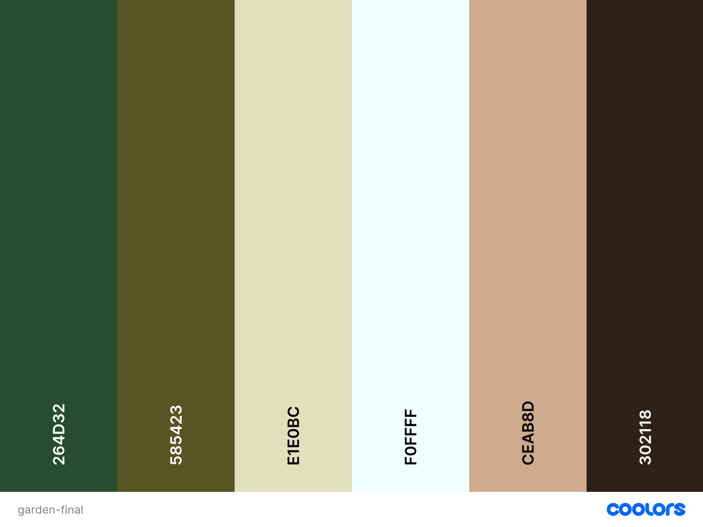
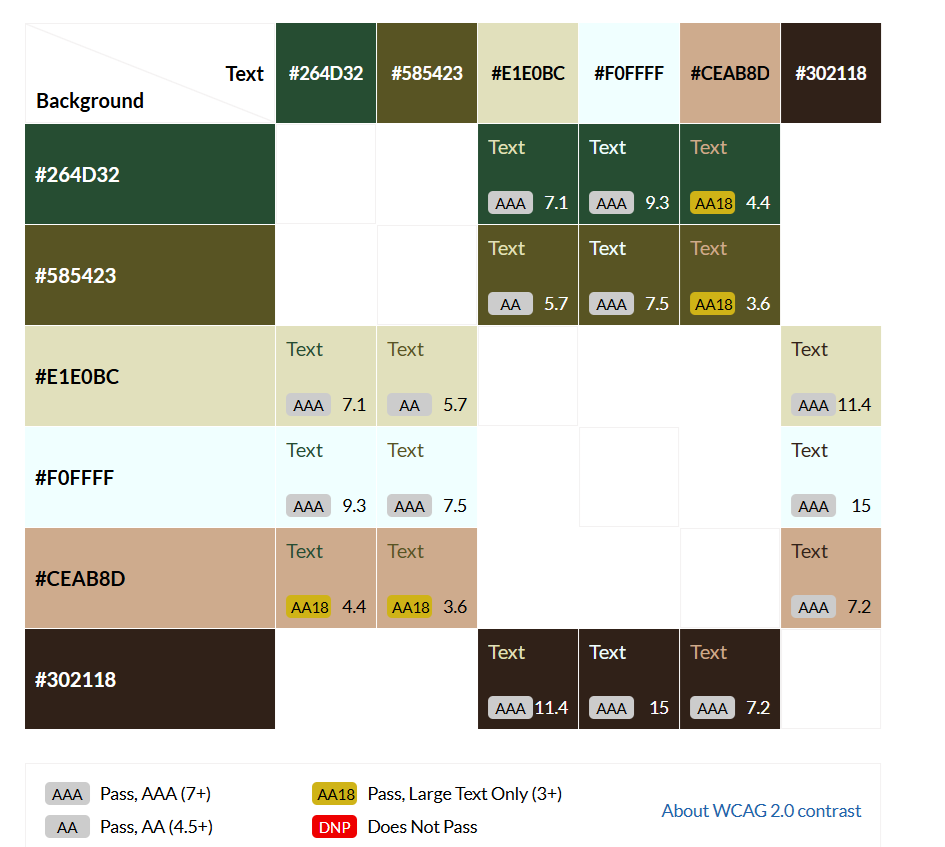

# Mow and More

[link to final deployed website](url)

A static website to promote the work of a small gardening/outside maintenance service with the overall aim of increasing bookings and gaining more clients.  As one-man business based in a middle class residential area with a high proportion of older adults, the key strengths that the website needs to convey are a local, friendly, trustworthy

### Contents

Use a TOC generator here.

## Website Goals and Objectives

A static website to promote the work of a small gardening/outside maintenance service with the overall aim of increasing bookings and gaining more clients.  As one-man business based in a middle class residential area with a high proportion of older adults, the key strengths that the website needs to convey are a local, friendly, trustworthy. Potential customers need to feel comfortable and confident letting someone into their property.

## Target Audience

Based in a middle class residential area with a high proportion of older adults the target audience fits into two main categories:

* Elderly or infirm people living in their own property who want to enjoy their outside space but are unable to manage the upkeep of it all themselves.
    * Contact may also come from children or carers/friends of these individuals.
* Families and individuals of working age who enjoy the garden but work all week and don't have time or the inclination to look after it.  As well as routine upkeep, this group may also be interested in:
    * Holiday garden care: to keep on top of the grass, water plants etc to make sure everything is nice for when they return.
    * Pre-house sale tidy-ups to make sure the property looks its best for estate agent photos.

The vast majority of residents are homeowners with very few rental properties.  For this reason, services offered to landlords will not be specifically mentioned or targeted on the website.

## User Goals

* A potential customer is looking on the internet to find someone reliable and skilled who has the correct tools and knowlegde to take care of the garden or outside property maintenance tasks which they are either no longer able to do or don't have the time/desire to do.
* Things the website user wants to know about the business:
    * The range of services offered: can they get their grass cut? What about hedges or pressure washing the patio?
    * Will the job be done well?  
    * Can I trust this person in my home?  What do other people say about the quality of work?
    * How long to jobs take and how much does it cost?
    * Do you cover my area and what days of the week/hours of the day do you work?
    * How to get in touch and book a visit. 

## User Stories

* **_Easy navigation and responsive design to the website_**
    * I'm looking for someone to do outside garden and propery maintenance.  I need to be able to find the information I am looking for (such as services offered, locations, price ranges, testimonials, how to get in touch) quickly and easily on all type of device (mobile, tablet and laptop).  If I can't find what I need or get frustrated by the site I'll leave and look elsewhere.
* **_Key benefits of using the service_**
    * As a potential client I want to know why I should book 'Mow & More' rather than another service.
* **_Business information_**
    * As a potential customer I want to know if I live within the area covered by the service and what days of the week you do the work.
* **_Engaging descriptions of the services offered_**
    * As a potential customer I want to know more about what you can offer: Can you cut my hedge?  Will you take the garden waste away?  Do you have tools or do I have to provide them?  What's included in patio pressure-washing?
    * I'm going on holiday for a fortnight and want someone to look after the garden while I'm away- cut the lawn, do a spot of weeding and tend any problems (for peace of mind).  Is this something you can offer?
* **_High quality images of the services offered_**
    * As someone looking to sell my house I want to see high quality images of what you can do, to ensure that you are able to make my property look 'market ready'.
    * As a potential customer I want to see that if I pay you to do a job that the job will be done well.
* **_Estimated pricing_**
    * As a potential customer I know that the cost of any job will depend on the size of the property/garden but seeing some guideline prices gives me more confidence than no costs mentioned at all.
* **_Testimonials from past customers_**
    * Looking after the garden has become too much for me and I want someone to cut the grass once a fortnight, collecting the grass cuttings.  I want to know the job will be well done but also that the person I let into my home is reliable and trustworthy.  I find reading testimonials prior to booking reassuring and gives me more confidence in booking.
    * As the child or carer for an elderly relative I want to know that the person coming to do the work is trustworthy.
* **_Inquiry form to get a quote for my garden_**
    * I like the look of what you can offer and want to get a quote for you to come and do my garden.
* **_Alternative methods of communication_**
    * As an older adult, I'd rather speak to you on the phone after submitting the contact form than getting an email reply.
    * I don't trust contact forms and would like to be able to find a phone number on your website to get in touch that way.
* **_Keeping up-to-date with current projects and offers_**
    * As a potential customer, I want to be able to look at your social media accounts to see photos of recent jobs or any offers you may currently have.
    * I don't use social media but want to keep up to date with your offers and seasonal recommendations.  Can I subscribe to your newsletter?
* **_Professional accreditation and certification_**
    * As a potential customer I feel reassured when I see professional accreditation and certification for trades people I let into my house and garden.
* **_What happens next?_**
    * As a potential customer, what happens after I submit an inquiry form with you? Do you get in touch and do the job straight away?  Can I meet you in person first?  When will you be able to give me a quote?

[Back to top](#mow-and-more)

## Wireframes

text- include here that the wireframes were generated using Balsamic and that designed with mobile first (following best practices)

[Wireframes for main page (all sections) on mobile, tablet and laptop](.docs-for-readme/design/main_page_wireframe.pdf)

[Wireframes for form success page (all sections) on mobile, tablet and laptop](.docs-for-readme/design/success_page_wireframe.pdf)

[Back to Top](#mow-and-more)

## Design Choices

### Typography

* A heading font of Poppins (Bold 700 and Bold 800) was chosen specifically with the target audience of the website in mind: an easy to read font, professional in appearance and neat & tidy (like the gardening service). It is also a relatively commonly used font.  With a high proportion of potential users being older adults, having a common font makes the site more approachable.
* The [Font Pair](https://www.fontpair.co/all) tool was used to guide a font to be used alongside Poppins for body text: Hind (regular 400, semi bold 600).
* For contrast and a more 'familar look' to the quotation text, the font Trirong was choosen with the aid of [Font Joy](https://fontjoy.com/#).

Further typography styling rules for site consistency:

|Text type | Bootstrap display level | Font Family | Font decoration/ styling/ weight | Colour | Notes |
|---|---|---|---|---|---|
|Sub Headings|Display 3|Poppins| bold|colour|Use of sentence case titles and headings (rather than capitalised or uppercase text) to give the page a more friendly appeal.|
|Service Headings|Display ?|Poppins| bold|colour| |
|Quotes from gardener| | Trirong| | | |
|Testimonial quotes| | Trirong| | | |
|Paragraph text| |Hind| regular|| |

### Colour Scheme

The colour scheme was chosen with green and earthy tones in mind.  Initial colours were generated using [Coolors](https://coolors.co/) and the hero image (a photo taken myself of a the front garden of a house with a flower border next to the house).  This colour palette was further refinded using the [WebAim Contrast Tool](https://webaim.org/resources/contrastchecker/) to maximise readability of text. 

This colour palette has been further verified for constrast and accessibility using the tool [Contrast-grid](https://contrast-grid.eightshapes.com/?version=1.1.0&background-colors=&foreground-colors=264D32%0D%0A585423%0D%0AE1E0BC%0D%0AF0FFFF%0D%0ACEAB8D%0D%0A302118%0D%0A&es-color-form__tile-size=compact&es-color-form__show-contrast=aaa&es-color-form__show-contrast=aa&es-color-form__show-contrast=aa18).

Table for colour variants used in code

|**CSS Name** | **Hex code**| **Comments**|
|---|---|---|
|--secondary-color|#264D32|dark green| 
|--highlight-color|#585423| mid green|
|--secondary-highlight|#E1E0BC| pale yellow green|
|--primary-background-color|#F0FFFF|off-white|
|--primary-highlight|#CEAB8D| pale tan|
|--primary-color|#302118|dark brown|

### Images
inlude links to where these were sourced from or created.  And why they were chosen.

The rest of the images were taken myself.  All images were optimised for web-viewing and converted to .webp files using 

#### Favicon
* Gardener and spade outline from [Icon Scout](https://iconscout.com/icons/gardener) designed by [Rank Sol](https://iconscout.com/contributors/promotion-king).  The outline changed to website dark green (#264D32) for consistent branding.
* Image converted and Favicon code generated by [Favicon.io](https://favicon.io/).

#### Images sourced from stock files:
* Lawn mowing image by [Rudy and Peter Skitterians](https://pixabay.com/users/clickerhappy-324082/?utm_source=link-attribution&utm_medium=referral&utm_campaign=image&utm_content=384589") from [Pixabay](https://pixabay.com//?utm_source=link-attribution&utm_medium=referral&utm_campaign=image&utm_content=384589)
* Weeding image by [Couleur](https://pixabay.com/users/couleur-1195798/?utm_source=link-attribution&utm_medium=referral&utm_campaign=image&utm_content=3296781) from [Pixabay](https://pixabay.com//?utm_source=link-attribution&utm_medium=referral&utm_campaign=image&utm_content=384589)
* Hedge and bush cutting image by [Alexa](https://pixabay.com/users/alexas_fotos-686414/?utm_source=link-attribution&utm_medium=referral&utm_campaign=image&utm_content=972972) from [Pixabay](https://pixabay.com//?utm_source=link-attribution&utm_medium=referral&utm_campaign=image&utm_content=384589)
* Pressure washing image by [Tomasz](https://stock.adobe.com/uk/contributor/200738455/tomasz-zajda) from [Stock Adobe](https://stock.adobe.com)
* Portrait shot of a gardener holding a plant in a pot from [FreePix](https://www.freepik.com/) (author unknown).

Stock images not used:
* Patio with chairs and flowers image by [PublicDomainPictures](https://pixabay.com/users/publicdomainpictures-14/?utm_source=link-attribution&utm_medium=referral&utm_campaign=image&utm_content=219900) from [Pixabay](https://pixabay.com//?utm_source=link-attribution&utm_medium=referral&utm_campaign=image&utm_content=384589)
* Patio with chairs image by [VariousPhotography](https://pixabay.com/users/variousphotography-1860391/?utm_source=link-attribution&utm_medium=referral&utm_campaign=image&utm_content=1596548) from [Pixabay](https://pixabay.com//?utm_source=link-attribution&utm_medium=referral&utm_campaign=image&utm_content=384589)
* nice garden https://stock.adobe.com/uk/contributor/205867852/oceane2508
* patio and lawn nice https://stock.adobe.com/uk/contributor/207792586/jennifer-j-taylor
* Wheel barrow image by [andreas160578](https://pixabay.com/users/andreas160578-2383079/?utm_source=link-attribution&utm_medium=referral&utm_campaign=image&utm_content=2157324)
* House and lawn image by [Barry D](https://pixabay.com/users/midascode-2412635/?utm_source=link-attribution&utm_medium=referral&utm_campaign=image&utm_content=2826052)
* lawn and chairs photo by Photo by Torsten Dettlaff: https://www.pexels.com/photo/round-brown-wooden-5-piece-dining-set-on-lawn-grass-59321/
* Digging photo by Photo by Lukas: https://www.pexels.com/photo/brown-shovel-296232/
* hand hedgecutting Photo by Anna Shvets: https://www.pexels.com/photo/close-up-shot-of-a-person-using-shears-to-trim-leaves-5027619/
* lawn photo Photo by Matthias Cooper: https://www.pexels.com/photo/macro-shot-of-grass-field-580900/
* outside of house with lawn Photo by Bilal Mansuri: https://www.pexels.com/photo/cgi-black-white-villa-13203194/
* lawn and flowers Photo by Alex Ohan: https://www.pexels.com/photo/vibrant-spring-tulip-garden-in-toronto-park-32307991/
* house and garden Photo by Pixabay: https://www.pexels.com/photo/brown-brick-house-beside-trees-259593/
* window flowers Photo by Mike Bird: https://www.pexels.com/photo/red-yellow-and-purple-flower-on-window-120173/
* patio and wooden chairs Photo by Marianne: https://www.pexels.com/photo/white-plates-on-table-238377/

### Responsiveness
text. Explain using Bootstrap media break points.

|**Breakpoint**|**Class infix**|**Dimensions**|
|---|---|---|
|X-Small|none|<576px|
|Small|`sm`|&ge;576px|
|Medium|`md`|&ge;768px|
|Large|`lg`|&ge;992px|
|X-Large|`xl`|&ge;1200px|
|xx-Large|`xxl`|&ge;1400px|

[Back to top](#heading-1)

## Features

### Existing Features

Home Page

* Nav bar
* Hero section
* About section (include area)
* Services section (include here approx pricing- don't give pricing it's own section as the business is based on quotation per job)
* Gallery or testimonials
* Get a quote (and what happens next)
* Footer: social media links, professional acreditation, 

Success Page - for when the contact form is completed.

#### Header

text

Header open

[Back to top](#heading-1)

#### home page

text

view on small screen

text

view on large screen

[Back to top](#heading-1)

#### Footer
text

Footer view

[Back to top](#heading-1)

### Future Enhancements

* list

[Back to top](#heading-1)

## Technologies Used

### Languages

* [HTML](https://developer.mozilla.org/en-US/docs/Glossary/HTML5)
* [CSS](https://developer.mozilla.org/en-US/docs/Web/CSS)
* [JS]()

### Libraries & Framework

* [Google Fonts](https://fonts.google.com/)
* [Favicon](https://favicon.io/)

### Tools

* [GitHub]()
* [GitPod]()
* [Balsamiq](https://balsamiq.com/)
* [W3C HTML Validation Service](https://validator.w3.org/#validate_by_input)
* [W3C CSS Validation Service](https://jigsaw.w3.org/css-validator/#validate_by_input)
* [Autoprefixer CSS online](https://autoprefixer.github.io/)
* [Font Awesome](https://fontawesome.com/)
* [Bootstrap v5.3.7](https://getbootstrap.com/)
* [Font Pair](https://www.fontpair.co/all)
* [Font Joy](https://fontjoy.com/#)
* [WebAim Contrast Tool](https://webaim.org/resources/contrastchecker/)
* [Coolors](https://coolors.co/)
* [PicFlow](https://picflow.com/)
* [Free Convert](https://www.freeconvert.com/)
* [Contrast-grid eightshapes](https://contrast-grid.eightshapes.com)

* Am I responsive
* Responsive Design Checker
* WAVE Accessibility Tool

[Back to top](#heading-1)

## Testing

### Bugs Fixed

text

|**Bug**|**Status**|**Description**|**Steps to Resolve**|
|---|---|---|---|
|bug one| fixed| what it is| how it was fixed|

[Back to top](#heading-1)

### Responsiveness Tests

Text: test responsiveness for mobile first design from the beginning using Chrome Dev Tools

Final Test Results

|**Size**|**Device Example**|**Navigation**| **Element Alignments**| **Content Placement**| **Functionality**| **Notes**|
|---|---|---|---|---|---|---|
|sm|Samsung Galaxy98|Good|Good|Good|Good|any notes|

[Back to top](#heading-1)

### Code Validation

#### HTML

Add in here tests using [W3C HTML Validator](https://validator.w3.org/). One for each page.

[Back to top](#heading-1)

#### CSS

Add in here tests using [W3C CSS Validator](https://jigsaw.w3.org/css-validator/). One for each page.

[Back to top](#heading-1)

### User Story Testing

|**User Story**|**Acceptance criteria**|**Screenshot**|
|---|---|---|
|Easy navigation and responsive design to the website| [ ] Logical navigation to access all sections and pages of the website and locate key information.|[name for screenshot](url-link-to-pdf)|
|| [ ] Website is responsive on all devices (mobile, tablet and laptop).||
|   | [ ] Browser favicon for branding. |   |
|Key benefits of using the service| [ ] Hero section to the main page with eye catching image and text|[name for screenshot](url-link-to-pdf)|
| | [ ] Easy to read bullet point or short text statements which highlight the key features which set this business apart from others| |
| | [ ] Due to aiming at 'local' and 'older adult' customers a photo of the gardener and making the user feel like they know the person who will be doing the job will inspire confidence| |
|Business information| [ ] Clearly stated the postcodes or geographical areas covered|[name for screenshot](url-link-to-pdf)|
| | [ ] Clearly stated business hours (Mon-Fri 8 am - 5 pm)| |
|Engaging descriptions of the services offered| [ ] kjl|[name for screenshot](url-link-to-pdf)|
|High quality images of the services offered| [ ] High quality images used across the site.|[name for screenshot](url-link-to-pdf)|
| | [ ] Links to social media profiles which will display photos of current or recent jobs.| |
|Estimated pricing| [ ] kjl|[name for screenshot](url-link-to-pdf)|
|Testimonials from past customers| [ ] kjl|[name for screenshot](url-link-to-pdf)|
|Inquiry form to get a quote for my garden| [ ] kjl|[name for screenshot](url-link-to-pdf)|
|Alternative methods of communication| [ ] Direct contact email address and phone number located in website footer (standard location)|[name for screenshot](url-link-to-pdf)|
| | [ ] Radio button required field for the inquiry form which allows potential customers to toggle between an email reply to book a quote and a phone call reply| |
|Keeping up-to-date with current projects and offers| [ ] Social media links found in the footer of the website (standard location)|[name for screenshot](url-link-to-pdf)|
| | [ ] Pop up modal in the website footer for users to subscribe to a newsletter| |
|Professional accreditation and certification| [ ] Accreditation badges with links to relevant sites along with logos of significant products used (with links) found in the footer of the website (standard location)|[name for screenshot](url-link-to-pdf)|
|What happens next| [ ] Above the inquiry form (and on the form submission 'Success Page') a simple step guide of what a customer is to expect (1. complete form, 2. email or phone call back to arrange a time to meet and assess for a quote, 3. get a quote and set a time for the job to be done, 4. Job done; can cancel or rearrange at any point.)|[name for screenshot](url-link-to-pdf)|

[Back to top](#heading-1)

### Feature Testing 

[Back to top](#heading-1)

### Accessibility Testing

WAVE for accessibility for users with diverse needs

Color Contrast Accessibility validation.

[Back to top](#heading-1)

### Lighthouse Testing

* Performance
* Accessibility
* Best Practices
* SEO 

[Back to top](#heading-1)

### Browser testing
 
Link to PDF for manually testing on different browsers and device sizes.

[Back to top](#heading-1)

## Deployment

### To deploy the project

### To fork the project

### To clone the project

[Back to top](#heading-1)

## Credits

* Support and guidance
    * [Simen Daehlin]()

* Text for website generated in part using ChatGPT
    *[ChatGPT suggested text](.docs-for-readme/design/ChatGPT_text_for_website_suggestions.pdf)

* Images
    * [IconScout](https://iconscout.com)
    * [Pixabay](https://pixabay.com)
    * [FreePix](https://www.freepik.com/)
    * [StockAdobe](https://stock.adobe.com)

* Similar websites viewed for inspiration (both good and bad):
    * [Solihull Gardeners ](https://solihullgardeners.co.uk/)
    * [Mr Womble's Home and Garden](https://www.mrwomblestidyhomeandgarden.co.uk/)
    * [Ed's Gardening Services](https://edsgardenservices.co.uk/)
    * [Glover Home and Gardening](https://www.gloverhomeandgarden.co.uk/)
    * [Birmingham Gardener](https://birminghamgardener.co.uk/)
    * [Green Gardeners](https://greengardeners.co.uk/)
    * [J Kelly Gardening Services](https://jkellygardeningservices.co.uk/)
    * [Ashcroft Gardening Services](https://www.ashcroftgardeningservices.co.uk/)
    * [APC Property](https://www.apcproperty.co.uk/)

[Back to top](#heading-1)
