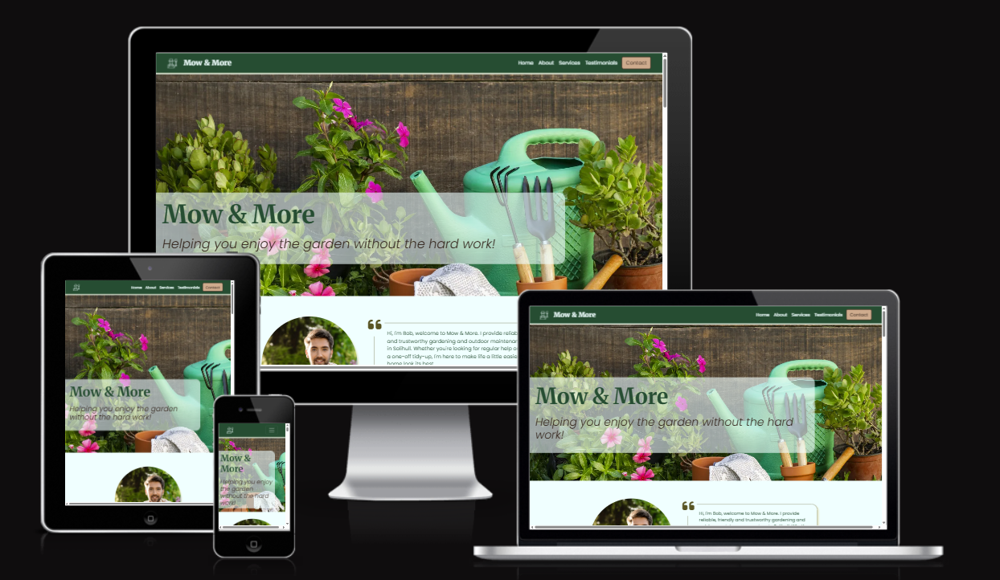
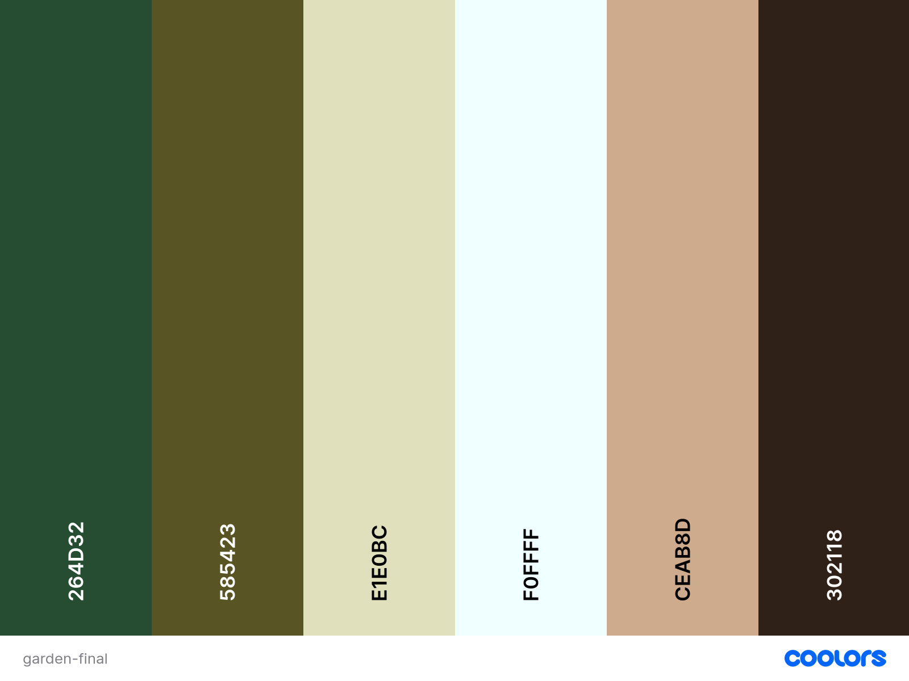
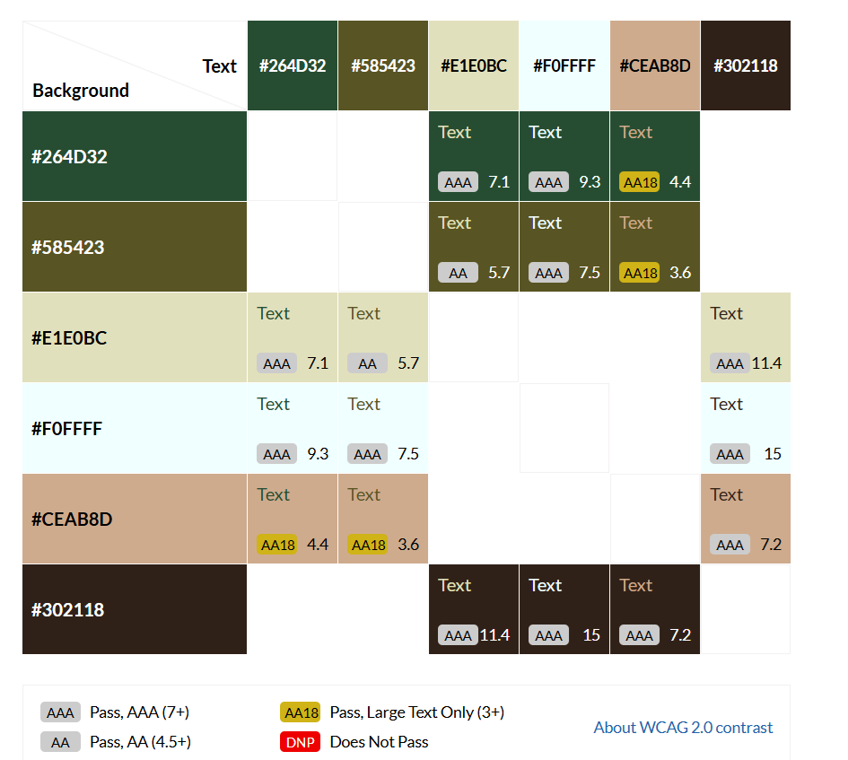
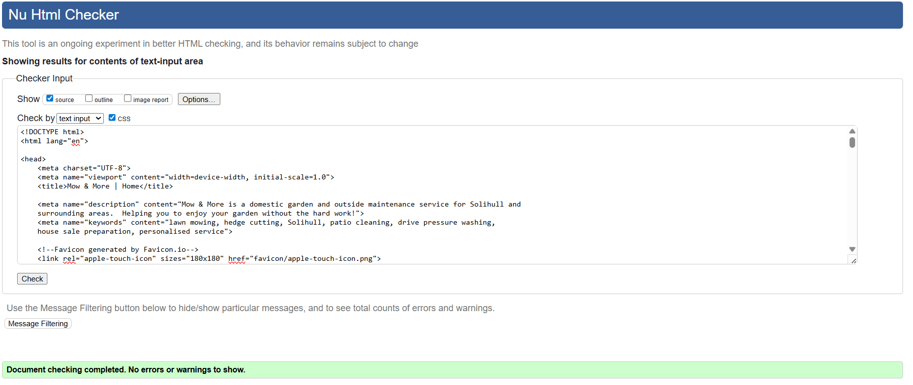
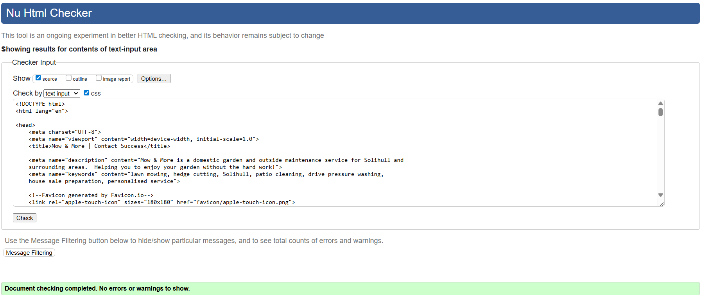
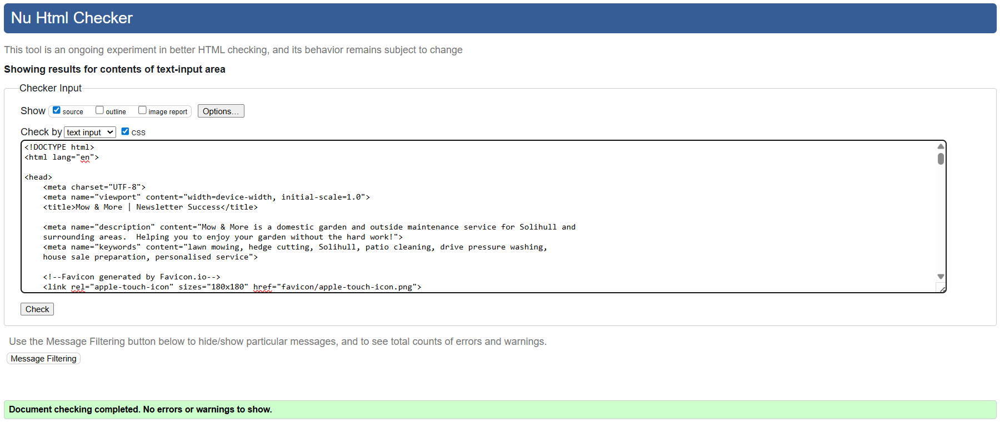
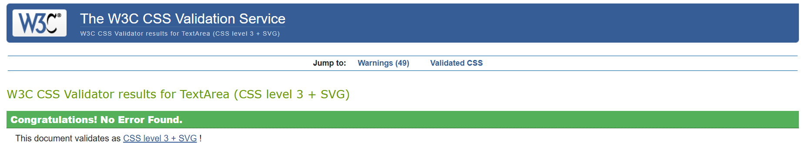
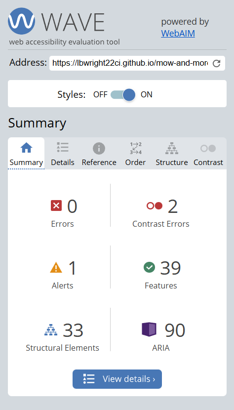

# Mow and More

[Mow & More](https://lbwright22ci.github.io/mow-and-more/)

A static website to promote the work of a small gardening/outside maintenance service with the overall aim of increasing bookings and gaining more clients.  As one-man business based in a middle class residential area with a high proportion of older adults, the key strengths that the website needs to convey are a local, friendly, trustworthy

### Contents

Use a TOC generator here.

## Website Goals and Objectives

A static website to promote the work of a small gardening/outside maintenance service with the overall aim of increasing bookings and gaining more clients.  As one-man business based in a middle class residential area with a high proportion of older adults, the key strengths that the website needs to convey are a local, friendly, trustworthy. Potential customers need to feel comfortable and confident letting someone into their property.

## Target Audience

Based in a middle class residential area with a high proportion of older adults the target audience fits into two main categories:

* Elderly or infirm people living in their own property who want to enjoy their outside space but are unable to manage the upkeep of it all themselves.
    * Contact may also come from children or carers/friends of these individuals.
* Families and individuals of working age who enjoy the garden but work all week and don't have time or the inclination to look after it.  As well as routine upkeep, this group may also be interested in:
    * Holiday garden care: to keep on top of the grass, water plants etc to make sure everything is nice for when they return.
    * Pre-house sale tidy-ups to make sure the property looks its best for estate agent photos.

The vast majority of residents are homeowners with very few rental properties.  For this reason, services offered to landlords will not be specifically mentioned or targeted on the website.

## User Goals

* A potential customer is looking on the internet to find someone reliable and skilled who has the correct tools and knowlegde to take care of the garden or outside property maintenance tasks which they are either no longer able to do or don't have the time/desire to do.
* Things the website user wants to know about the business:
    * The range of services offered: can they get their grass cut? What about hedges or pressure washing the patio?
    * Will the job be done well?  
    * Can I trust this person in my home?  What do other people say about the quality of work?
    * How long to jobs take and how much does it cost?
    * Do you cover my area and what days of the week/hours of the day do you work?
    * How to get in touch and book a visit. 

## User Stories

* **_Easy navigation and responsive design to the website_**
    * I'm looking for someone to do outside garden and propery maintenance.  I need to be able to find the information I am looking for (such as services offered, locations, price ranges, testimonials, how to get in touch) quickly and easily on all type of device (mobile, tablet and laptop).  If I can't find what I need or get frustrated by the site I'll leave and look elsewhere.
* **_Key benefits of using the service_**
    * As a potential client I want to know why I should book 'Mow & More' rather than another service.
* **_Business information_**
    * As a potential customer I want to know if I live within the area covered by the service and what days of the week you do the work.
* **_Engaging descriptions of the services offered_**
    * As a potential customer I want to know more about what you can offer: Can you cut my hedge?  Will you take the garden waste away?  Do you have tools or do I have to provide them?  What's included in patio pressure-washing?
    * I'm going on holiday for a fortnight and want someone to look after the garden while I'm away- cut the lawn, do a spot of weeding and tend any problems (for peace of mind).  Is this something you can offer?
* **_High quality images of the services offered_**
    * As someone looking to sell my house I want to see high quality images of what you can do, to ensure that you are able to make my property look 'market ready'.
    * As a potential customer I want to see that if I pay you to do a job that the job will be done well.
* **_Estimated pricing_**
    * As a potential customer I know that the cost of any job will depend on the size of the property/garden but seeing some guideline prices gives me more confidence than no costs mentioned at all.
* **_Testimonials from past customers_**
    * Looking after the garden has become too much for me and I want someone to cut the grass once a fortnight, collecting the grass cuttings.  I want to know the job will be well done but also that the person I let into my home is reliable and trustworthy.  I find reading testimonials prior to booking reassuring and gives me more confidence in booking.
    * As the child or carer for an elderly relative I want to know that the person coming to do the work is trustworthy.
* **_Inquiry form to get a quote for my garden_**
    * I like the look of what you can offer and want to get a quote for you to come and do my garden.
* **_Alternative methods of communication_**
    * As an older adult, I'd rather speak to you on the phone after submitting the contact form than getting an email reply.
    * I don't trust contact forms and would like to be able to find a phone number on your website to get in touch that way.
* **_Keeping up-to-date with current projects and offers_**
    * As a potential customer, I want to be able to look at your social media accounts to see photos of recent jobs or any offers you may currently have.
    * I don't use social media but want to keep up to date with your offers and seasonal recommendations.  Can I subscribe to your newsletter?
* **_Professional accreditation and certification_**
    * As a potential customer I feel reassured when I see professional accreditation and certification for trades people I let into my house and garden.
* **_What happens next?_**
    * As a potential customer, what happens after I submit an inquiry form with you? Do you get in touch and do the job straight away?  Can I meet you in person first?  When will you be able to give me a quote?

[Back to top](#mow-and-more)

## Wireframes

Wireframes for the site were created using [Balsamiq](https://balsamiq.com/).  In accordance with industry standards and best practices, the site was designed with a 'mobile-first' appoach.  The design of a single, scrollable page aimed keep the user interested and gradually provide them with the information they need in a prioritised manner, minimises the number of 'click' steps necessary between landing on the site and submitting an inquiry form (the desired outcome).  Navigation in a fixed header at the top of the page will allow those who decide they want to book immediately to jump to this point on the page.

Wireframes for tablet and laptop screens utilise the extra screen space available in comparison to mobile devices.

Initial wireframes changed when the website was being built to improve the user experience.  Specifically, clear section breaks were added.

[Evolutionary wireframes for main page (all sections) on mobile, tablet and laptop](docs/design/main-page-wireframe.pdf)

[Evolutionary wireframes for form success page (all sections) on mobile, tablet and laptop](docs/design/success-page-wireframe.pdf)

[Back to Top](#mow-and-more)

## Design Choices

### Typography

* A brand font of Merriweather was chosen specifically with the target audience of the website in mind: professional and traditional.  With a high proportion of potential users being older adults the 'classic', reliable 'feel' for the brand is important.  Being a Serif font though, Merriweather is less widely used for online text.  Hence, in accordance with best practices, Merriweather was limited to the brand name and section headings only.
* The [Font Pair](https://www.fontpair.co/all) tool was used to guide a font to be used alongside Merriweather for heading and body text: Poppins.
* Poppins is a commonly used font with high readability, which is important for site accessibility.

Further typography styling rules for site consistency:

|Text type | Bootstrap display level | Font Family | Font decoration/ styling/ weight | Colour | Notes |
|---|---|---|---|---|---|
|Brand name| depends on site location|Merriweather| bold, weight 700 or 800| Secondary colour||
|h2 section headings| display-3| Merriweather| weight 500| Secondary colour| Use of sentence case titles and headings (rather than capitalised or uppercase text) to give the page a more approachable appeal.|
|h3 headings| display-6| Poppins| weight 700| Secondary colour| Use of sentence case titles and headings (rather than capitalised or uppercase text) to give the page a more approachable appeal. Reduce font weight for card headings to 500.|
|Quotes| paragraph text| Poppins| regular | Secondary colour| |
|Quotes- author| paragraph text| Poppins| italic, weight 300 | highlight color| |
|Quotes- address| paragraph text| Poppins| weight 500 | Secondary colour| |
|Paragraph text| |Poppins| regular| Primary colour| |
|Lead paragraph text| |Poppins| weight 500| Secondary colour| About section only|
|Navbar menu text||Poppins|| primary background colour|links change to primary highlight colour with underline when hovered|
|Footer headings|as for H3 headings| Poppins| as for H3 headings, size 1.2 rem| Primary background colour||
|Footer text| | Poppins| size 0.8 rem| Primary background colour||

### Colour Scheme

The colour scheme was chosen with green and earthy tones in mind.  Initial colours were generated using [Coolors](https://coolors.co/) and the hero image (stock image sourced from FreePiks of some pots and a watering can in front of a fence).  This colour palette was further refinded using the [WebAim Contrast Tool](https://webaim.org/resources/contrastchecker/) to maximise readability of text. 

This colour palette has been further verified for constrast and accessibility using the tool [Contrast-grid](https://contrast-grid.eightshapes.com/?version=1.1.0&background-colors=&foreground-colors=264D32%0D%0A585423%0D%0AE1E0BC%0D%0AF0FFFF%0D%0ACEAB8D%0D%0A302118%0D%0A&es-color-form__tile-size=compact&es-color-form__show-contrast=aaa&es-color-form__show-contrast=aa&es-color-form__show-contrast=aa18).

A table of the colour variants used:

|**CSS Name** | **Hex code**| **Comments**|
|---|---|---|
|--secondary-color|#264D32|dark green| 
|--highlight-color|#585423| mid green|
|--secondary-highlight|#E1E0BC| pale yellow green|
|--primary-background-color|#F0FFFF|off-white|
|--primary-highlight|#CEAB8D| pale tan|
|--primary-color|#302118|dark brown|

### Buttons

There are two different styled buttons used on the site: the primary style which is for 'Call to action' links (get in touch, submit the inquiry form, subscribe to the newsletter) and a secondary button for form reset.  All colour combinations pass the [Contrast Grid accessibility AAA test score](#colour-scheme).

|**Button Type**|**Text colour**|**Background colour**|**Border colour**|**Colour Constrast Score**|
|---|---|---|---|---|
|Call to action| primary colour| primary highlight | primary colour| 7.2 AAA|
|Call to action: hover| primary background colour| primary colour| primary background colour|15 AAA|
|Reset|  primary colour| primary background colour| primary colour| 15 AAA|
|Reset: hover|  primary colour| primary background colour| primary background colour| 15 AAA|

### Images
A combination of stock images and those taken myself are used on the website.  The stock images are used for the hero image and in the services section and were chosen to be a clear visual guide of the services offered by the business (lawn mowing, weeding, general gardening, hedge trimming and pressure washing).  Images for the carousel in the about section and those in the testimonials were taken by myself and are suggestive of results after the gardener has been to visit.

The brand icon of the gardener with a spade was sourced for the site specifically.  This is used in the favicon, navigation bar and at the top of each section in the section heading.

All photos were converted to .webp files and optimized to less than 200kB for web-viewing with the aim to optimise site performance.

#### Favicon
* Gardener and spade outline from [Icon Scout](https://iconscout.com/icons/gardener) designed by [Rank Sol](https://iconscout.com/contributors/promotion-king).  The outline changed to website dark green (#264D32) for consistent branding.
* Image converted and Favicon code generated by [Favicon.io](https://favicon.io/).

#### Images sourced from stock files:
* Hero image of plant pots with watering can from [FreePik](https://www.freepik.com/)(author unknown)
* Lawn mowing image by [Rudy and Peter Skitterians](https://pixabay.com/users/clickerhappy-324082/?utm_source=link-attribution&utm_medium=referral&utm_campaign=image&utm_content=384589") from [Pixabay](https://pixabay.com//?utm_source=link-attribution&utm_medium=referral&utm_campaign=image&utm_content=384589)
* Weeding image by [Couleur](https://pixabay.com/users/couleur-1195798/?utm_source=link-attribution&utm_medium=referral&utm_campaign=image&utm_content=3296781) from [Pixabay](https://pixabay.com//?utm_source=link-attribution&utm_medium=referral&utm_campaign=image&utm_content=384589)
* Hedge and bush cutting image by [Alexa](https://pixabay.com/users/alexas_fotos-686414/?utm_source=link-attribution&utm_medium=referral&utm_campaign=image&utm_content=972972) from [Pixabay](https://pixabay.com//?utm_source=link-attribution&utm_medium=referral&utm_campaign=image&utm_content=384589)
* Pressure washing image by [Tomasz](https://stock.adobe.com/uk/contributor/200738455/tomasz-zajda) from [Stock Adobe](https://stock.adobe.com)
* Portrait shot of a gardener holding a plant in a pot from [FreePix](https://www.freepik.com/) (author unknown).

#### Images for accreditation section
The badges and awards/accreditations in the footer of the website are fictional.  Images were sourced for free from:
* [Check-a-trade](https://pureecosolutions.co.uk/checkatrade-logo/) logo 
* [Trust a Trader](https://www.facebook.com/TrustATrader/) badge
* [City & Guilds NPTC](https://www.nptc.org.uk/) logo

### Responsiveness
In accordance with best practices, the website was designed mobile first (portrait orientation with screen heights of 621px and more).  For the main site structure, screen-size-dependent responsive styling was implemented using the Bootstrap grid system.  The same screen breakpoint dimensions were then employed for all custom CSS added.  

Screen responsiveness for mouse point hovering was implemented for laptop dimensions only in most cases as a cursor tip pointer is not present on touch screen devices such as mobile and tablet.

The breakpoint dimensions are as follows:

|**Breakpoint**|**Class infix**|**Dimensions**|
|---|---|---|
|X-Small|none|<576px|
|Small|`sm`|&ge;576px|
|Medium|`md`|&ge;768px|
|Large|`lg`|&ge;992px|
|X-Large|`xl`|&ge;1200px|
|XX-Large|`xxl`|&ge;1400px|

One additional breakpoint was implemented to ensure the text above the hero image at the top of the page was visible on 'short' screens (those such as old phones- iPhone4/5, and phones in landscape orientation) with `max-height` less than 620px.

[Back to top](#mow-and-more)

## Features

### Existing Features

The site consists of one main page with a navigation bar at the top, followed by a hero image, four information sections (about, services, testimonials and contact form) and a footer.  

This scrolling-type design was adopted over a paginated structure to improve user experience on mobile devices. It allows the viewer to progressively gain more information (in a logical, need-to-know basis) about the service before getting to the enquiry form in order to book.  A fixed header with a direct link to the contact form section allows those who want to jump to the enquiry form immediately to do so. The number of 'clicks' between landing on the website and submitting an inquiry is one or two at most.

In addition to the main page, there is a modal which opens (from a button in the website footer) from which users can request to join the newsletter and two short webpages the user is directed to after successfully submitting the newsletter subscription request and contact form respectively (a separate success page for each).  Consistent layout and styling is applied across all pages on the website.

#### Header

text

Header open

[Back to top](#mow-and-more)

#### home page

text

view on small screen

text

view on large screen

[Back to top](#mow-and-more)

#### Footer
text

Footer view

[Back to top](#mow-and-more)

### Future Enhancements

* Add separate webpages for each of the different services offered so that more details can be given.  These could include things such as products or equipment used and a gallery of photos from past jobs and/or testimonials relating specifically to that service.
* Further development of the booking/inquiry form so that:
    * Users are required to tick at least one of the service checkboxes in order to submit the form.
    * Specific time slots can be booked online without the need to go through a quote system first.
* Links to policy documents in the footer of the website (such as Terms and Conditions, Data Protection etc).

[Back to top](#mow-and-more)

## Technologies Used

### Languages

* [HTML](https://developer.mozilla.org/en-US/docs/Glossary/HTML5)
* [CSS](https://developer.mozilla.org/en-US/docs/Web/CSS)
* [JS](https://developer.mozilla.org/en-US/docs/Web/JavaScript)

### Libraries & Framework

* [Google Fonts](https://fonts.google.com/)
* [Favicon](https://favicon.io/)

### Tools

* [GitHub](https://github.com/)
* [VSCode](https://code.visualstudio.com/)
* [Balsamiq](https://balsamiq.com/)
* [W3C HTML Validation Service](https://validator.w3.org/#validate_by_input)
* [W3C CSS Validation Service](https://jigsaw.w3.org/css-validator/#validate_by_input)
* [Autoprefixer CSS online](https://autoprefixer.github.io/)
* [Font Awesome](https://fontawesome.com/)
* [Bootstrap v5.3.7](https://getbootstrap.com/)
* [Font Pair](https://www.fontpair.co/all)
* [WebAim Contrast Tool](https://webaim.org/resources/contrastchecker/)
* [Coolors](https://coolors.co/)
* [PicFlow](https://picflow.com/)
* [Free Convert](https://www.freeconvert.com/)
* [X Convert](https://www.xconvert.com/)
* [Contrast-grid eightshapes](https://contrast-grid.eightshapes.com)
* [Am I responsive](https://ui.dev/amiresponsive)
* Responsive Design Checker
* [WAVE Accessibility Evaluation Tool](https://wave.webaim.org/)

[Back to top](#mow-and-more)

## Testing

### Bugs Fixed

Bugs identified while writing the code.

|**Bug**|**Status**|**Description**|**Steps to Resolve**|
|---|---|---|---|
|Expanded navigation on mobile not collapsing when Contact button is selected| fixed| When the contact button is selected the navigation menu remained open despite the custom JS code added (supplied from Code Institute during Boardwalk Games project)| Add the 'nav-link' class to the button.  A special ID also required then so that the button is styled as a button and not as a hyperlink|
|Gardener portrait image not displaying in about section| fixed| Gardener portrait added as a background image to a `div`; in the about section with height = width and 50% radius. None of this was displaying on the website| Typo in custom class used to identify the `div` in style.css |
|Formatting the carousel with rounded corners| fixed| For consistency of image styling throughout the page the carousel images need to have the same border radius as service card images.| Apply custom CSS style to all `img` which are descendants of the About section (with ID #about).  Applying styling to #about descendants with class '.carousel-item' did not work.|
|Date and costs not spaced evenly at the base of service cards| fixed| When written as two `span` groups the date icon and text next to the price icon and text did not display equally spaced along the bottom of the service cards.| Re-write this part of the code as two `div`s and add them to a parent `div` with flexbox styling `justify-content: space-evenly`|
|Phone number field in contact form accepting text input| fixed| When using `input type="tel"` it was possible to submit the form with text (rather than numbers) in the Phone field of the contact form.| Change to `input type="number"`.  Note `type="tel"` is not recognised by all browsers.|
|UX warning from Chrome Dev tools: form input fields do not have autocomplete enabled|fixed |With some browsers on some devices, without `autocomplete` attribute being defined, the form might be incorrectly completed| Add the `autocomplete` atribute too name, phone number, email and address fields of the form |
|Lighthouse warning _Found an &lt;h1&gt; tag within an &lt;article&gt;, &lt;aside&gt;, &lt;nav&gt;, or &lt;section&gt; which does not have a specified font-size._ |Fixed|Adding styling css code [suggested](https://developer.mozilla.org/en-US/blog/h1-element-styles/) did not solve the problem| Changing the hero image and `h1` title from a `section` to the `header` resolved the problem|
|Check boxes in the contact form are not compulsary| not fixed| Desired outcome is that the user needs to select at least one of the service checkboxes that they are interested in to be able to submit the form. | It is not possible to resolve this without the use of extra JS code.  With HTML alone, the only options are to make all checkboxes mandatory (which isn't appropriate as not every user will want to ask about every service) or to use the radio function where a user can only select one option (also not appropriate as users may wish to inquire about both lawn mowing and another job).|
|Hero image text box too large on short screens such as landscape mobiles and old phones (iPhone 4 and 5)|fixed| Hero title text lies below the navigation bar and extends above the top of the screen | Add responsive styling CSS based on screens with `max-width` less than 620px.|

[Back to top](#mow-and-more)

### Responsiveness Tests

Text: test responsiveness for mobile first design from the beginning using Chrome Dev Tools

Final Test Results

|**Size**|**Device Example**|**Navigation**| **Element Alignments**| **Content Placement**| **Functionality**| **Notes**|
|---|---|---|---|---|---|---|
|sm|Samsung Galaxy98|Good|Good|Good|Good|any notes|

[Back to top](#mow-and-more)

### Code Validation

#### HTML

The HTML code from each of the three webpages- index.html, success.html and success-newsletter- was tested using the [W3C HTML Validator](https://validator.w3.org/). No errors or warnings were found. The results are presented below:

[Back to top](#mow-and-more)

#### CSS

The CSS code written specifically for the site (style.css) was validated using [W3C CSS Validator](https://jigsaw.w3.org/css-validator/). No errors were found. The warnings related to either:
* imported style sheets (from Google Fonts)
* CSS variables which are not validated by the W3C CSS Validator
* Extentions added by Autoprefixer to ensure the code functioned in the desired way across different browsers.

[Back to top](#mow-and-more)

### User Story Testing

|**User Story**|**Pass?**|**Acceptance criteria**|**Screenshot**|
|---|---|---|---|
|Easy navigation and responsive design to the website|| Logical navigation to access all sections and pages of the website and locate key information.|[name for screenshot](url-link-to-pdf)|
||| Website is responsive on all devices (mobile, tablet and laptop).||
|   || Browser favicon for branding. |   |
|Key benefits of using the service|| Hero section to the main page with eye catching image and text|[name for screenshot](url-link-to-pdf)|
| | |Easy to read bullet point or short text statements which highlight the key features which set this business apart from others| |
| || Due to aiming at 'local' and 'older adult' customers a photo of the gardener and making the user feel like they know the person who will be doing the job will inspire confidence| |
|Business information| |Clearly stated the postcodes or geographical areas covered|[name for screenshot](url-link-to-pdf)|
| | |Clearly stated business hours (Mon-Fri 8 am - 5 pm)| |
|Engaging descriptions of the services offered|| Key benefits of employing this gardening business in simple, easy to read, eye catching text close to the top of the webpage|[name for screenshot](url-link-to-pdf)|
|| |More in depth information about specific services along with an image in a dedicated 'Service' section.||
|| |Advice on periods of the year when a service is available: this is important for gardening when some jobs may not be apropriate in winter||
|High quality images of the services offered| |High quality images used across the site.|[name for screenshot](url-link-to-pdf)|
| | |Links to social media profiles which will display photos of current or recent jobs.| |
|Estimated pricing| |Pricing per hour for each type of the four common services displayed visibly.  The exact cost will depend on the size of the job, but this will give customers a guideline.|[name for screenshot](url-link-to-pdf)|
|Testimonials from past customers| |A range of short quotes from existing or past customers which talk about their experience of the different services they opted for.|[name for screenshot](url-link-to-pdf)|
|| |Testimonials should be styled in a manner consistent across the internet to inspire confidence: image, star rating, quote, name and some kind of address of the customer||
|Inquiry form to get a quote for my garden| |Inquiry form easily found accross the site.|[name for screenshot](url-link-to-pdf)|
|| |Inquiry form is intutive and accessible (including accessible to those with screen readers). ||
|| |Once submitted the form takes the user through to a success page.||
|| |Collect key information (required): name, email, phone number, address of property, service interested in (lawn care, hedge maintenance, weeding, patio & drive cleaning)||
|| |Additional field for the customer to leave any extra information (optional).||
|| |Option on the form to say how they want to hear back: phone call or email (required).||
|Alternative methods of communication| |Direct contact email address and phone number located in website footer (standard location)|[name for screenshot](url-link-to-pdf)|
| | |Radio button required field for the inquiry form which allows potential customers to toggle between an email reply to book a quote and a phone call reply| |
|Keeping up-to-date with current projects and offers| |Social media links found in the footer of the website (standard location)|[name for screenshot](url-link-to-pdf)|
| | |Pop up modal in the website footer for users to subscribe to a newsletter| |
|Professional accreditation and certification| |Accreditation badges with links to relevant sites along with logos of significant products used (with links) found in the footer of the website (standard location)|[name for screenshot](url-link-to-pdf)|
|What happens next| |Above the inquiry form (and on the form submission 'Success Page') a simple step guide of what a customer is to expect (1. complete form, 2. email or phone call back to arrange a time to meet and assess for a quote, 3. get a quote and set a time for the job to be done, 4. Job done; can cancel or rearrange at any point.)|[name for screenshot](url-link-to-pdf)|

[Back to top](#mow-and-more)

### Feature Testing 

[Back to top](#mow-and-more)

### Accessibility Testing

To ensure that the website is accessible to screen readers, those with impaired vision and others with diverse needs, the deployed site was evaluated using the [WAVE Accessiblity Tool](https://wave.webaim.org/). The results are presented below:

Three issues were highlighted:
* The two contrast errors relate to the visual contrast between the carousel previous/next image icon arrows on the left/right of the photos, respectively.  The Bootstrap default line arrows were replaced with a solid circle icon from FontAwesome and both the opacity and font size increased to make these more apparent.  The carousel image slider bar was also moved below the images and increased in size.  There are also the appropriate Aria labels for controlling carousel movement via a screen reader.
* A warning for a deduntant (repeated) HTML link in the navigation bar was highlighted.  This refers to both the brand logo on the left and the menu item 'Home' taking the user to the same place.  It is standard practice to present both options in a navigation bar.

[Back to top](#mow-and-more)

### Lighthouse Testing

* Performance
* Accessibility
* Best Practices
* SEO 

[Back to top](#mow-and-more)

### Browser testing
 
Link to PDF for manually testing on different browsers and device sizes.

[Back to top](#mow-and-more)

## Deployment

### To deploy the project

### To fork the project

### To clone the project

[Back to top](#mow-and-more)

## Credits

* Support and guidance
    * [Simen Daehlin](https://github.com/eventyret)

* Text for website generated in part using ChatGPT
    * [ChatGPT](https://chatgpt.com/)

* Images
    * [IconScout](https://iconscout.com)
    * [Pixabay](https://pixabay.com)
    * [FreePix](https://www.freepik.com/)
    * [StockAdobe](https://stock.adobe.com)

* Similar websites viewed for inspiration (both good and bad):
    * [Solihull Gardeners ](https://solihullgardeners.co.uk/)
    * [Mr Womble's Home and Garden](https://www.mrwomblestidyhomeandgarden.co.uk/)
    * [Ed's Gardening Services](https://edsgardenservices.co.uk/)
    * [Glover Home and Gardening](https://www.gloverhomeandgarden.co.uk/)
    * [Birmingham Gardener](https://birminghamgardener.co.uk/)
    * [Green Gardeners](https://greengardeners.co.uk/)
    * [J Kelly Gardening Services](https://jkellygardeningservices.co.uk/)
    * [Ashcroft Gardening Services](https://www.ashcroftgardeningservices.co.uk/)
    * [APC Property](https://www.apcproperty.co.uk/)

* Code
    * [W3 Schools](https://www.w3schools.com/) 
    * [Code Institute](https://learn.codeinstitute.net/)
    * [mdn web docs](https://developer.mozilla.org/)

[Back to top](#mow-and-more)
